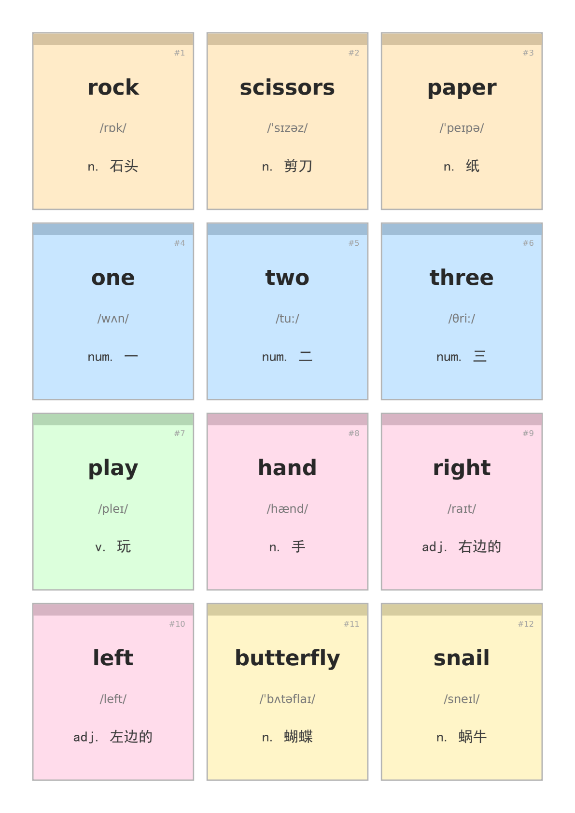
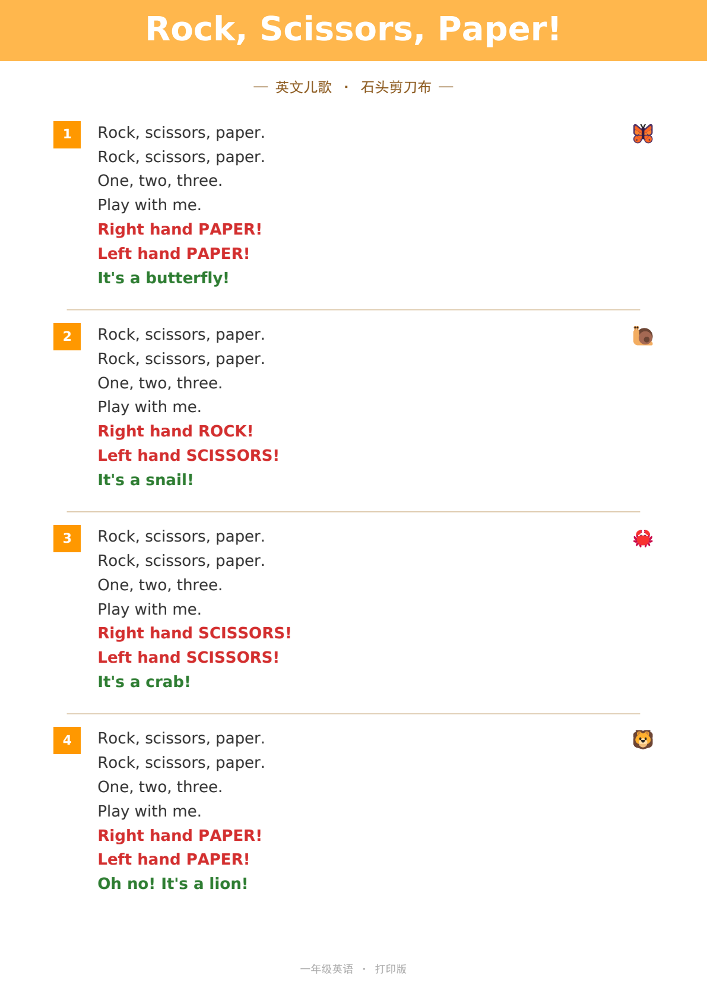
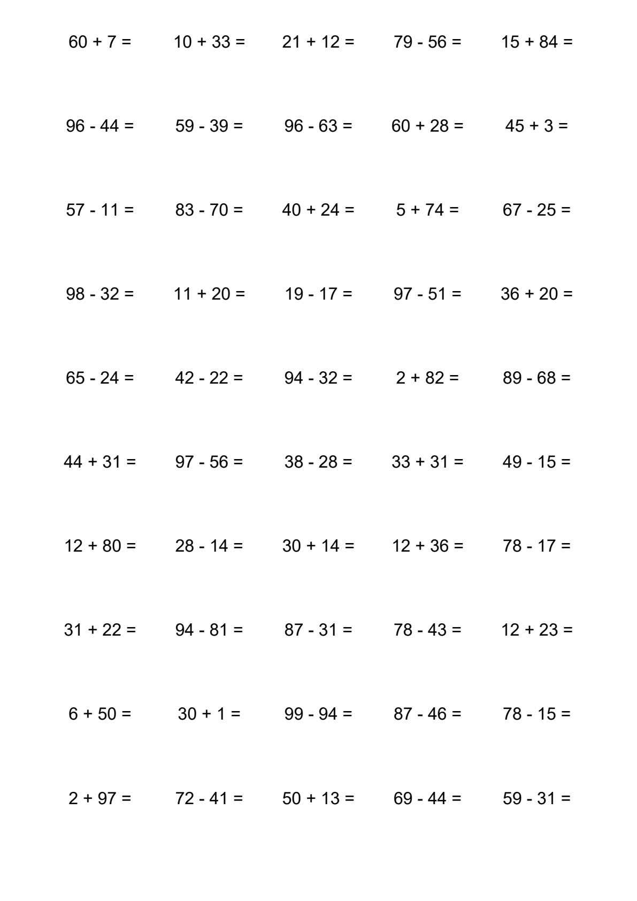

# 示例脚本

这些脚本由 **ragtag_crew** 根据用户需求自动生成——用户只需用自然语言描述想要什么，ragtag_crew 会自行编写、调试、执行脚本并交付结果。以下为真实使用中生成的例子，其中有些例子效果都超出我的想象了。

## 可复用 & 按需生成

- **直接复用**：这些脚本可直接运行或修改参数适配不同内容。
- **按需修改**：要换词汇、换配色、换布局？告诉 ragtag_crew，它会改现有脚本。
- **编写新脚本**：需要其他学科、其他格式、其他风格？告诉 ragtag_crew，它会从头写新脚本。

---

## 单词卡片 PDF

`gen_word_cards_lyrics.py` — 生成 A4 单词卡片 PDF（3×4 布局，16 张卡片），按词汇类别（核心词、数字、动作、身体、动物）分色，含英文、音标、中文释义。

## 歌词 PDF

`gen_lyrics_pdf.py` — 生成美化排版的歌词 PDF，含标题栏、段落分隔、手势词高亮（红）和动物词高亮（绿），适合课堂打印使用。

## 数学练习 PDF

`gen_math_100.py` — 批量生成 20 份 100 以内加减法练习题 PDF（不进位不借位），每页 50 道题（5×10 布局），适用于一年级练习。

---

## 使用方式

不需要手动安装依赖或运行 Python 脚本。直接把需求告诉 ragtag_crew 即可，例如：

- "给定下面歌词，帮我提取单词，生成一个给小孩子学习用的便于打印的A4排版的单词卡片 PDF。（后面粘贴歌词）"
- "把这首歌词排版成好看的 PDF"
- "生成 20 份 100 以内加减法练习题"

ragtag_crew 会自动找到或编写合适的脚本，生成你需要的文件。
